[linkedin](https://www.linkedin.com/in/gauravkumbhar0491/) &nbsp;·&nbsp;
[github](https://github.com/GauravKumbhar0491) &nbsp;·&nbsp;
[email](mailto:gauravkumbhar.work@gmail.com)

> Data Science & ML student passionate about turning messy data into meaningful insights. 
> Clean models, honest baselines, and reproducible pipelines over black-box magic.

I build end-to-end ML pipelines — from raw data cleaning through EDA, feature engineering and 
model training to deployment. My work sits at the intersection of classical statistics and modern 
deep learning: regression, classification, decision trees, random forests, SVMs, CNNs, and NLP. 
Right now I am deep into computer vision with OpenCV and scikit-image.

<samp>python &nbsp; sql &nbsp; numpy &nbsp; pandas &nbsp; scikit-learn &nbsp; pytorch &nbsp; tensorflow &nbsp; opencv &nbsp; flask &nbsp; django &nbsp; power-bi &nbsp; git &nbsp; linux</samp>

  

**P.E.S Modern College Of Engineering** &nbsp;·&nbsp; <samp>Pune, Maharashtra</samp> 
B.Tech &mdash; Artificial Intelligence and Data Science &nbsp;|&nbsp; CGPA: 8.42 &nbsp;|&nbsp; 2022-2026

**Sadguru Gadage Maharaj College** &nbsp;·&nbsp; <samp>Karad, Maharashtra</samp> 
Higher Secondary Certificate &nbsp;|&nbsp; 73.64% &nbsp;|&nbsp; 2020-2022

**Yashwant Highschool** &nbsp;·&nbsp; <samp>Karad, Maharashtra</samp> 
Secondary School Certificate &nbsp;|&nbsp; 90.80% &nbsp;|&nbsp; 2020

**[CardioScan](https://github.com/GauravKumbhar0491/CardioScan)** &nbsp;·&nbsp; <samp>python, pytorch, opencv</samp> 
Deep-learning cardiac analysis pipeline. CNN-based segmentation and classification 
of echocardiogram data, with a Flask API for clinical inference.

**[Placement Hub](https://github.com/GauravKumbhar0491/Placement-Hub)** &nbsp;·&nbsp; <samp>html, css, javascript, python, flask, mysql</samp> 
Student-centric platform for placement preparation. Integrated authentication 
and resource management modules with optimized backend queries.

**[Blood Bank Management System](https://github.com/GauravKumbhar0491/Blood-Bank-Management)** &nbsp;·&nbsp; <samp>html, css, javascript, node.js, mysql</samp> 
Platform for donor/recipient registration with secure MySQL storage. Features 
real-time blood stock search by group, state, and city.

  

**Skyswoops Electrical and Solar System Solutions** &nbsp;·&nbsp; <samp>Jan 2025 - Mar 2025</samp> 
*Full-Stack Development Intern* 
Collaborated with a 4-member team to design & deploy a full-stack e-commerce website. 
Improved page load speed by 40%, reducing bounce rates and enhancing user experience.

  

- **freeCodeCamp** &mdash; Data Analysis with Python
- **Cognitive Class** &mdash; SQL and Relational Databases 101
- **IBM Grade-AI** &mdash; Practical knowledge in AI/ML model building and deployment
- **CISCO** &mdash; Data Science Essentials with Python

Every graphic here is generated, not embedded from anyone else's server. 
`ascii.svg` is a photo pushed through a character ramp by 
[`scripts/make_portrait.py`](scripts/make_portrait.py); the stat graphics and 
these section headings are drawn by [a scheduled action](.github/workflows/stats.yml) 
straight from the GitHub GraphQL API, once a day, committing only what changed.

They animate with SMIL inside the SVG, because GitHub strips scripts from 
READMEs — and since nothing loads from a third party, nothing here can 
rate-limit or go dark. The headings are SVGs for the same reason: GitHub also 
strips CSS, so an image is the only way to put this page's own typeface on them.

The typeface is [JetBrains Mono](scripts/fonts), subset to just the characters 
each graphic draws and inlined as base64. Language totals cover public 
repositories only. `year.svg` uses the portrait character ramp: `:` `+` `#` `@`, quiet to loud.
